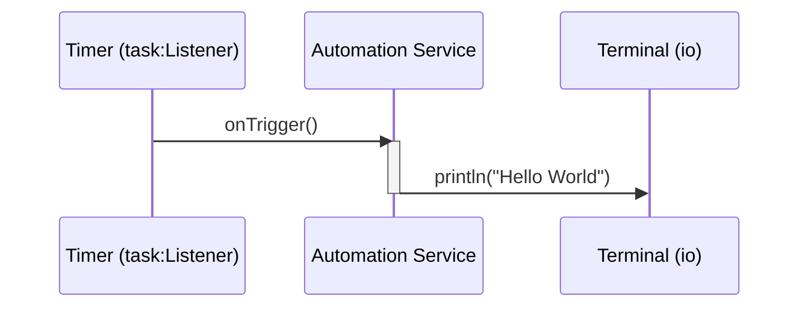

# Quick start: Build an automation

**Time:** Under 10 minutes | **What you'll build:** A scheduled automation that runs tasks on a timer or manual trigger.

Automations are ideal for data synchronization, report generation, and routine maintenance jobs.

## Prerequisites

- [WSO2 Integrator installed](install.md)

## Architecture



## Step 1: Create the project

1. Open WSO2 Integrator.
2. Select **Create New Integration**.
3. Enter the integration name (for example, `MyAutomation`).

## Step 2: Add an automation artifact

1. In the design view, add an **Automation** artifact.
2. The automation starts with an empty flow.

## Step 3: Add logic

1. Add a **Call Function** node to the flow.
2. Configure it with a simple expression:

```ballerina
import ballerina/io;

public function main() {
    io:println("Hello World");
}
```

## Step 4: Run and test

1. Select **Run** in the toolbar.
2. The automation executes immediately and prints output to the terminal.
3. Check the terminal output for `Hello World`.

## Scheduling automations

For production use, configure a cron schedule to trigger the automation periodically:

```ballerina
import ballerina/task;

listener task:Listener timer = new ({
    intervalInMillis: 60000  // Run every 60 seconds
});

service on timer {
    remote function onTrigger() {
        // Your automation logic here
    }
}
```

## What's next

- [Quick start: Integration as API](quick-start-api.md) -- Build an HTTP service
- [Quick start: Event integration](quick-start-event.md) -- React to messages from brokers
- [Quick start: AI agent](quick-start-ai-agent.md) -- Build an intelligent agent
