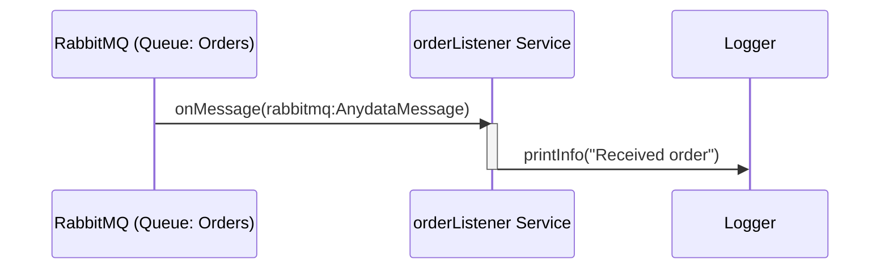

# Quick start: Event integration

**Time:** Under 10 minutes | **What you'll build:** An event-driven integration that consumes messages from RabbitMQ and processes them.

Event integrations are ideal for reactive workflows triggered by messages from Kafka, RabbitMQ, MQTT, or other message brokers.

## Prerequisites

- [WSO2 Integrator installed](install.md)
- A running RabbitMQ instance (or use Docker: `docker run -d -p 5672:5672 -p 15672:15672 rabbitmq:management`)

## Architecture



## Step 1: Create the project

1. Open WSO2 Integrator.
2. Select **Create New Integration**.
3. Enter the integration name (for example, `OrderProcessor`).

## Step 2: Add an event integration artifact

1. In the design view, add a **RabbitMQ** event integration artifact.
2. Configure the connection:
   - **Queue:** `Orders`
   - **Host:** `localhost`
   - **Port:** `5672`
   - **Username:** `guest`
   - **Password:** `guest`

## Step 3: Add message processing logic

Add an `onMessage` handler to process incoming messages:

```ballerina
import ballerinax/rabbitmq;
import ballerina/log;

listener rabbitmq:Listener orderListener = new (
    host = "localhost",
    port = 5672
);

@rabbitmq:ServiceConfig {queueName: "Orders"}
service on orderListener {
    remote function onMessage(rabbitmq:AnydataMessage message) returns error? {
        log:printInfo("Received order", content = message.content.toString());
    }
}
```

## Step 4: Run and test

1. Select **Run** in the toolbar.
2. The service starts listening for messages on the `Orders` queue.
3. Publish a test message to RabbitMQ using the management UI at `http://localhost:15672` or a client.
4. Check the terminal output for the logged message.

## Supported event sources

| Broker | Ballerina Package |
|---|---|
| Apache Kafka | `ballerinax/kafka` |
| RabbitMQ | `ballerinax/rabbitmq` |
| MQTT | `ballerinax/mqtt` |
| Azure Service Bus | `ballerinax/azure.servicebus` |
| Salesforce | `ballerinax/salesforce` |
| GitHub Webhooks | `ballerinax/github` |

## What's next

- [Quick start: File integration](quick-start-file.md) -- Process files from FTP or local directories
- [Quick start: Integration as API](quick-start-api.md) -- Build an HTTP service
- [Event handlers](/docs/develop/integration-artifacts/event-handlers) -- Advanced event-driven patterns
