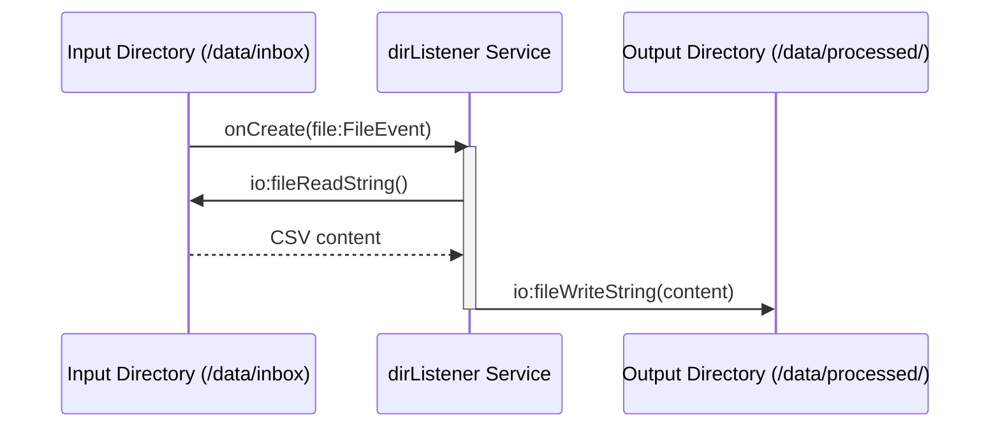

# Quick start: File integration

**Time:** Under 10 minutes | **What you'll build:** A file integration that watches a directory for new files, processes them, and writes the output.

File integrations are ideal for batch uploads, scheduled file processing, and ETL workflows triggered by files appearing in a folder or FTP server.

## Prerequisites

- [WSO2 Integrator installed](install.md)

## Architecture



## Step 1: Create the project

1. Open WSO2 Integrator.
2. Select **Create New Integration**.
3. Enter the integration name (for example, `FileProcessor`).

## Step 2: Add a file integration artifact

1. In the design view, add a **Directory Service** (for local files) or **FTP Service** (for remote files) artifact.
2. Configure the directory path to watch.

## Step 3: Process incoming files

Add logic to read and process files when they arrive:

```ballerina
import ballerina/file;
import ballerina/io;
import ballerina/log;

listener file:Listener dirListener = new ({
    path: "/data/inbox",
    recursive: false
});

service on dirListener {
    remote function onCreate(file:FileEvent event) returns error? {
        string filePath = event.name;
        log:printInfo("New file detected", path = filePath);

        // Read CSV content
        string content = check io:fileReadString(filePath);
        log:printInfo("File content", content = content);

        // Process and write output
        check io:fileWriteString("/data/processed/" + filePath, content);
    }
}
```

## Step 4: Run and test

1. Select **Run** in the toolbar.
2. Drop a file into the watched directory (`/data/inbox`).
3. Verify the processed output appears in `/data/processed/`.

## Supported file sources

| Source | Transport | Use Case |
|---|---|---|
| Local directory | File system | Development, on-premise batch processing |
| FTP | FTP | Legacy file exchange |
| FTPS | FTP over TLS | Secure legacy file exchange |
| SFTP | SSH File Transfer | Secure file exchange |

## What's next

- [Quick start: Automation](quick-start-automation.md) -- Build scheduled jobs
- [Quick start: Integration as API](quick-start-api.md) -- Build an HTTP service
- [File handlers](/docs/develop/integration-artifacts/file-handlers) -- Advanced file processing patterns
